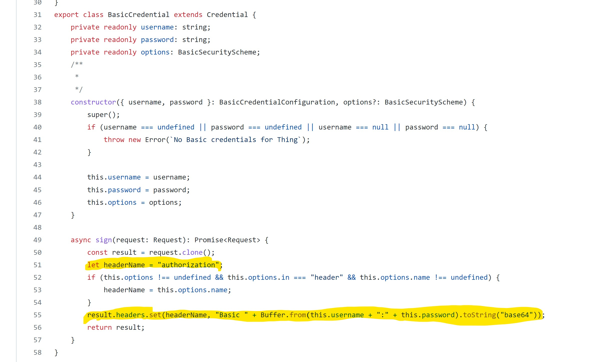
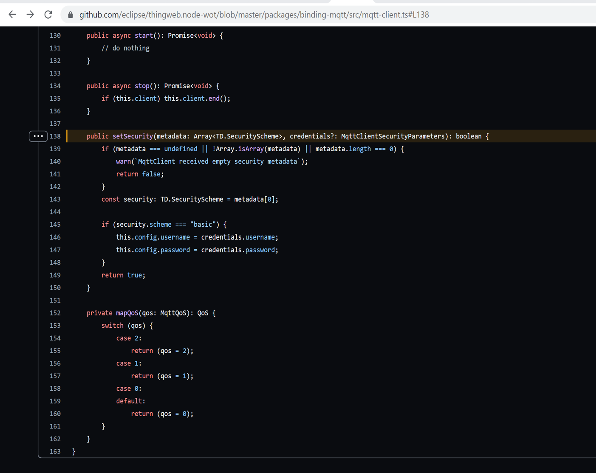
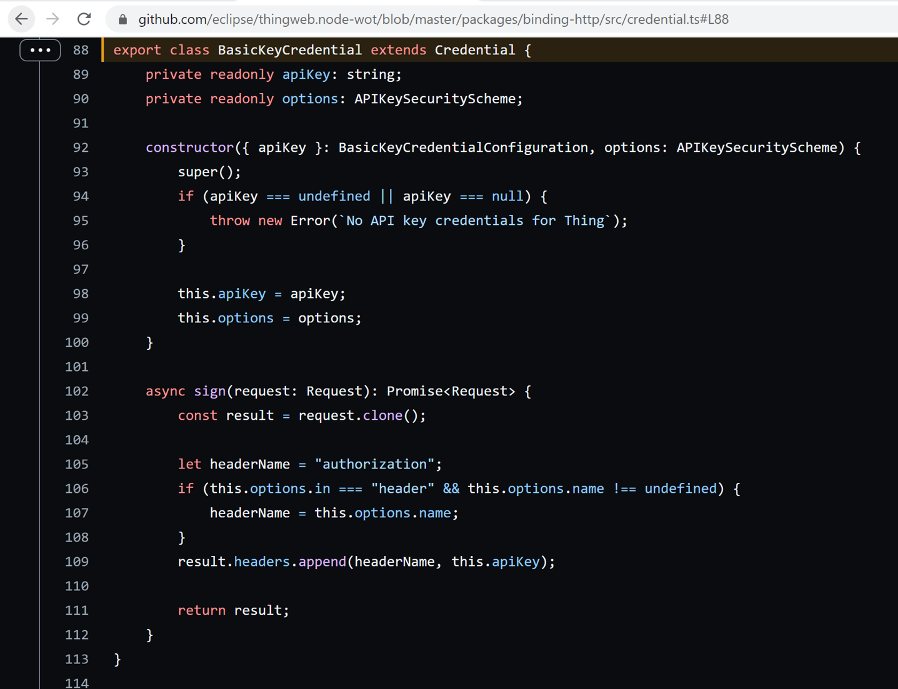
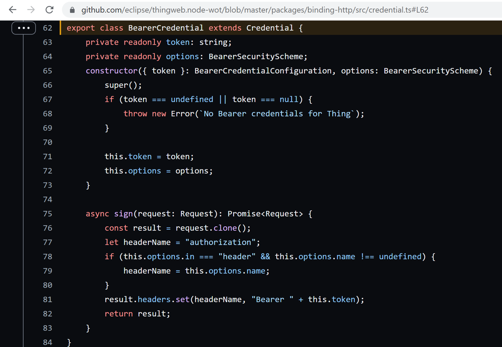
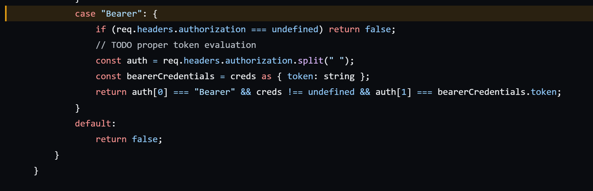
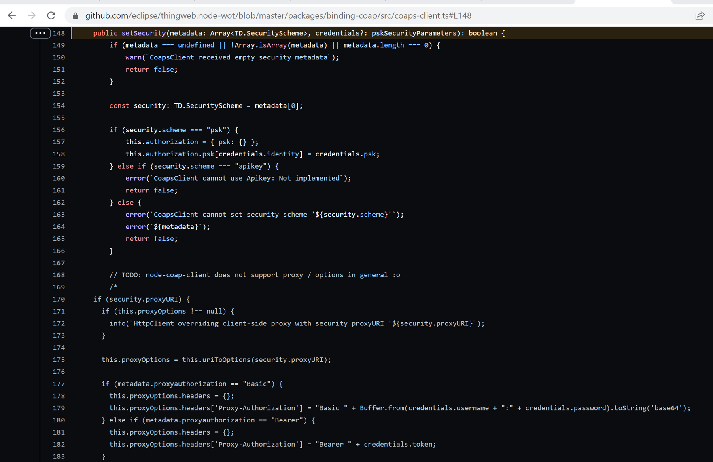

# Flexibility of Things Description compared with node-wot implementation

Comparison of the flexibility of the security scheme described in the Things Description w.r.t. the node wot implementation.
- Combo and Auto Security scheme is not implemented.
---
**Suggestion**
In node-wot, anyone can view the TD. There is no Security scheme verification done to fetch the TD. The Things Description contains a lot of information, specially once combo security scheme is implemented, any attacker can see the weak points in TD. So there should be a security check done if the security parameter is defined in the TD.

---
The security scheme mentioned in Things Description are:
1. NoSecurityScheme
2. BasicSecurityScheme
3. DigestSecurityScheme
4. APISecurityScheme
5. BearerSecurityScheme
6. PSKSecurityScheme
7. OAuth2SecurityScheme

## BasicSecurityScheme

In Things Description, Basic has 2 vocabulary terms namely **name** and **in**.

- The term **name:authorization** is hard coded in the code and hence does not offer the flexibility for the application/user to define their own name.

- Basic Security scheme only support **in:header** as it uses the basic-auth library which extract the credentials from the header. 

  
[Reference](https://github.com/eclipse/thingweb.node-wot/blob/b174a3b5eceb5b784457c820bce1b8614e53fa7c/packages/binding-http/src/credential.ts#L49)

- In node-wot, it is implemented for producer and consumer(HTTP protocol). [ref](https://github.com/eclipse/thingweb.node-wot/tree/master/packages/binding-http#server-example)

- In node-wot, it is implemented for consumer (MQTT). 

 

---
**Suggestions**
- In case of wrong credentials where one of producer and consumer are not using node-wot, node-wot should send a www-authenticate header indicating the authentication mechanism used.
---

## DigestSecurityScheme

In Things Description, Digest has 3 vocabulary terms namely **qop**, **name** and **in**.
- In node-wot, digest has not been implemented yet. [ref](https://github.com/eclipse/thingweb.node-wot/tree/master/packages/binding-http#server-example) 

---
**Suggestions**
- There should be 1 parameter in Things Description which should be used to give the flexibility to chose the algorithm like MD5, SHA256 etc like it is done for bearer token scheme. [ref](https://www.rfc-editor.org/rfc/rfc7616#section-3.7)
- There should be some support for negotiations of parameters like algorithm, nonce, opaque parameter which is used to calculate the final response value.
- Things Description can have some optional parameters like opaque and realm which are used to calculate the digest value and can be static(based on the requirement of the application). 
- Section 3.4 of rfc7616 states all the necessary rules required for the Authorization header. [ref](https://www.rfc-editor.org/rfc/rfc7616#section-3.4)
---

## APISecurityScheme

In Things Description, Basic has 2 vocabulary terms namely **name** and **in**.

- The term **name:authorization** is hard coded in the code and hence does not offer the flexibility for the application/user to define their own name. [ref](https://github.com/eclipse/thingweb.node-wot/blob/b174a3b5eceb5b784457c820bce1b8614e53fa7c/packages/binding-http/src/credential.ts#L49)

- API key Security scheme only support **in:header**. [ref](https://github.com/eclipse/thingweb.node-wot/blob/b174a3b5eceb5b784457c820bce1b8614e53fa7c/packages/binding-http/src/credential.ts#L88) 

  

- In node-wot, it is implemented for consumer(HTTP protocol). [ref](https://github.com/eclipse/thingweb.node-wot/tree/master/packages/binding-http#server-example)

---
**Suggestions**
- There should be 1 parameter in the Things descriptions which can be used to set the expiry of the key.
---

## BearerSecurityScheme

In Things Description, Basic has 5 vocabulary terms namely **authorization**, **algo**, **format**, **name** and **in**.

- The term **name:authorization** is hard coded in the code and hence does not offer the flexibility for the application/user to define their own name. [ref](https://github.com/eclipse/thingweb.node-wot/blob/b174a3b5eceb5b784457c820bce1b8614e53fa7c/packages/binding-http/src/credential.ts#L77)

- Bearer Security scheme only support **in:header** as it uses the basic-auth library which extract the credentials from the header. [ref](https://github.com/eclipse/thingweb.node-wot/blob/b174a3b5eceb5b784457c820bce1b8614e53fa7c/packages/binding-http/src/credential.ts#L81) 

  

- In node-wot, it is implemented for producer and consumer(HTTP protocol). [ref](https://github.com/eclipse/thingweb.node-wot/tree/master/packages/binding-http#server-example)

- Token evaluation is not done like CWT token is created in a certain way and can be verified by the producer to check if it is coming from an authenticated consumer. [ref](https://github.com/eclipse/thingweb.node-wot/blob/b174a3b5eceb5b784457c820bce1b8614e53fa7c/packages/binding-http/src/http-server.ts#L453)

- In node-wot, only comparison of token is done. Parameters like algo, authorization, format is not been implemented. [ref](https://github.com/eclipse/thingweb.node-wot/blob/b174a3b5eceb5b784457c820bce1b8614e53fa7c/packages/binding-http/src/http-server.ts#L453) 

  

## PSKSecurityScheme

In Things Description, Basic has 1 vocabulary terms namely **identity**.

- In node-wot, it is implemented for consumer(CoAP protocol). [ref](https://github.com/eclipse/thingweb.node-wot/blob/b174a3b5eceb5b784457c820bce1b8614e53fa7c/packages/binding-coap/src/coaps-client.ts#L148) 

 

## OAuth2SecurityScheme

In Things Description, Basic has 5 vocabulary terms namely **authorization**, **token**,**refresh**,**scopes** and **flow**.

- Client credential and Resource Owner credential flow is only implemented in node-wot. [ref](https://github.com/eclipse/thingweb.node-wot/tree/master/packages/binding-http#oauth20)

- For some server, the parameter like clientId, clientSecret has to be sent in body for client credential flow which is not implemented yet. [ref](https://github.com/eclipse/thingweb.node-wot/blob/b174a3b5eceb5b784457c820bce1b8614e53fa7c/packages/binding-http/src/oauth-manager.ts#L86)

- Error response is not done completely. [ref](https://github.com/eclipse/thingweb.node-wot/blob/b174a3b5eceb5b784457c820bce1b8614e53fa7c/packages/binding-http/src/http-server.ts#L445)

- The example code given to test the OAuth client implemnetation is not working. [ref](https://github.com/eclipse/thingweb.node-wot/issues/873)

---
**Suggestions**
- To distinguish between these server there should be a parameter stating where should the credential be send like the in parameter for other schemes.

---
